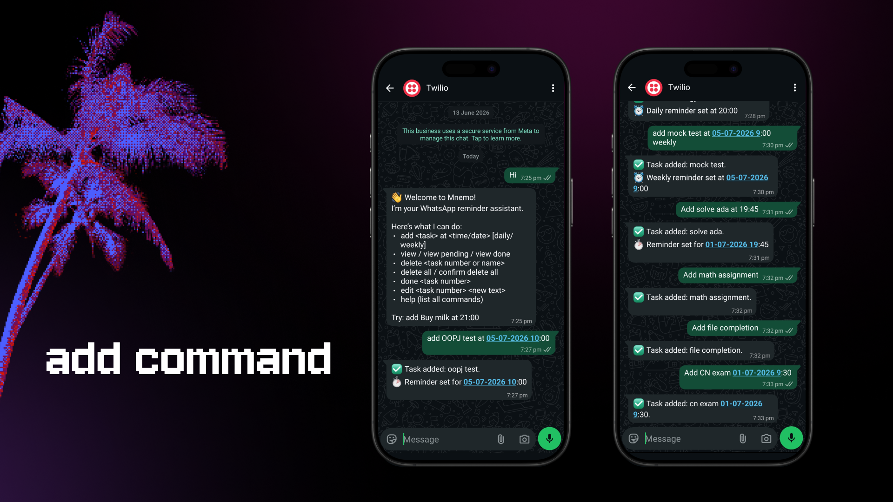
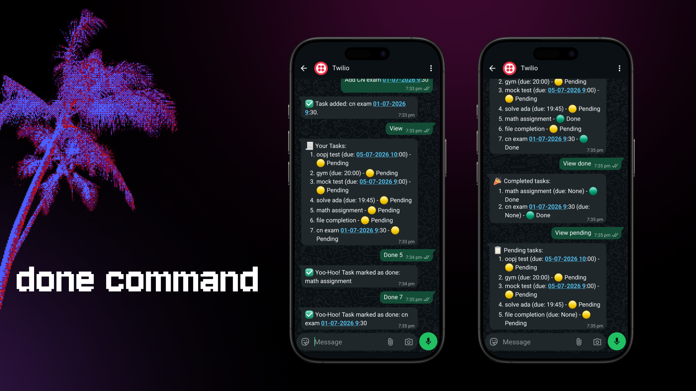
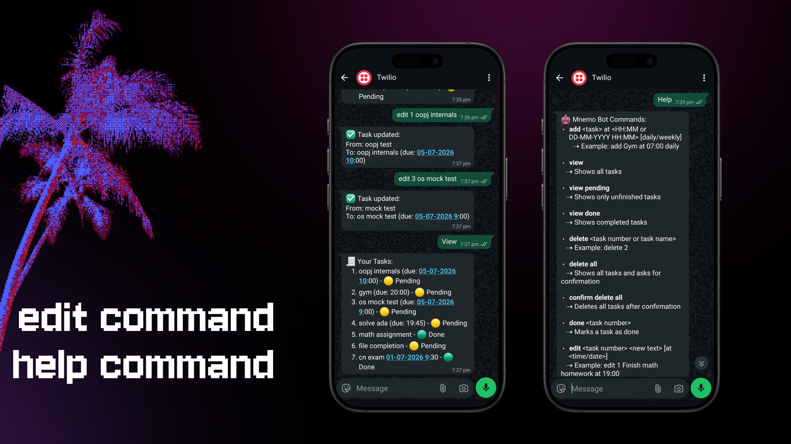
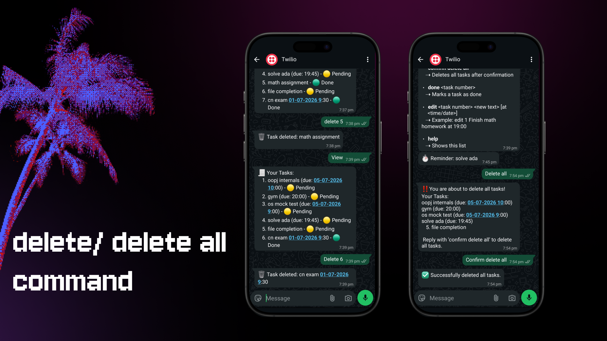

<div align="center">

</div>

# Mnemo — Your Timekeeper Companion ⏳

Mnemo is a smart WhatsApp assistant that helps you stay on track with life’s tasks.  
Add one‑time or recurring reminders, mark them as done, edit on the fly, and view pending or completed tasks — all through simple chat commands. With Mnemo, your schedule flows naturally, and nothing slips through the cracks.

---

## Features
- 📝 Add tasks with one‑time or recurring reminders (`daily`, `weekly`)
- 📃 View tasks (all, pending, done)
- ✅ Mark tasks as done
- ✏️ Edit tasks (update text or due date)
- 🗑️ Delete tasks (single or all with confirmation)
- 🤖 Help command (lists all available commands)
- 👋 Friendly onboarding and goodbye messages
- 📅 Consistent **DD‑MM‑YYYY** date format

---

## Tech Stack
- **Python** — core language
- **Flask** — web framework for WhatsApp webhook
- **Twilio API (WhatsApp)** — messaging integration
- **APScheduler** — scheduling reminders
- **SQLite / Postgres** — task storage
- **dotenv** — environment variable management
- **Heroku / ngrok** — deployment and testing

---

## Getting Started

### 1. Clone the repo
```bash
git clone https://github.com/ShravNaik/mnemo-reminder-bot.git
cd mnemo-reminder-bot
```
### 2. Installing Dependencies
```bash
pip install -r requirements.txt
```
### 3. Set environment variables
**NOTE: You have to create a free Twilio account, then go to sandbox settings and connect your phone number using the QR or with the special joining code.**<br><br>
create a .env file:
```bash
TWILIO_ACCOUNT_SID=your_sid
TWILIO_AUTH_TOKEN=your_token
TWILIO_WHATSAPP_NUMBER=your_twilio_number
```
### 4. Run locally
```bash
   python app.py
```
### 5. Expose with ngrok
```bash
ngrok http 5000
```

## Example Commands
- add Buy milk at 18-06-2026 09:30
- add Gym at 07:00 daily
- view
- done 1
- edit 1 Finish math homework at 19:00
- delete 2
- delete all
- help

## Demonstration Pictures
1. add command:
   
2. done command:
   
3. edit/ help command:
   
4. delete/ Delete all command:
   
5. Reminder:
   
